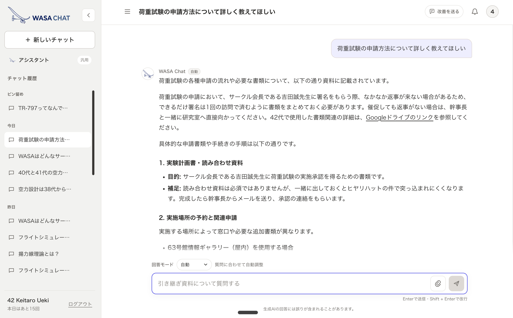
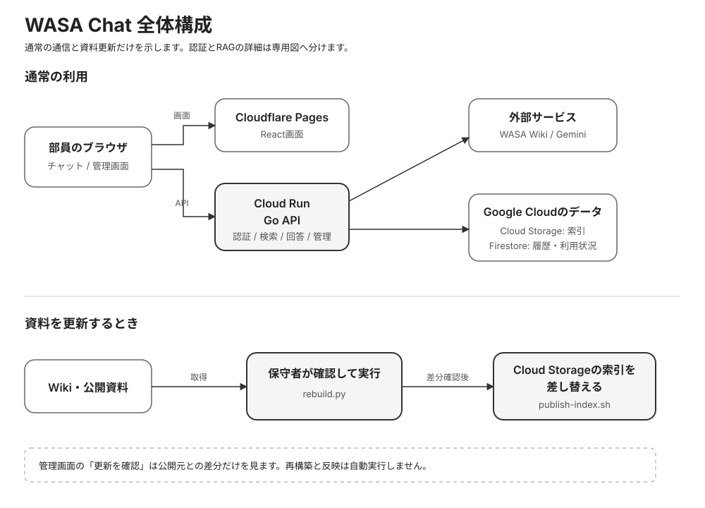

# WASA Chat

> 本番運用・精度改善フェーズ

## 概要

WASAの引き継ぎWikiと公開資料を横断して、自然言語で質問できるチャットボットです。
回答に使った資料は、本文中の番号リンクから確認できます。

現在は次の資料を索引へ取り込んでいます。

- WASA引き継ぎWiki
- WASA公式サイト
- フライトシミュレータガイド（FEE）

主な機能は、出典付きチャット、画像添付、共有アシスタント、最大30件の履歴です。
管理者は専用画面から利用状況、APIの推定残量、資料の更新、監査ログを確認できます。
共有管理者アカウントは使わず、個人のWikiアカウントへ管理者ロールを付けます。

## システム構成

画面はCloudflare Pages、認証・検索・回答生成・管理APIはCloud Runが担当します。
Wiki本文を含む索引は非公開のCloud Storage、履歴や利用状況はFirestoreへ保存します。
質問のたびにWiki本文を取得せず、事前に作った索引を検索します。

資料の変更確認は管理画面から行えますが、再構築と本番反映は人が内容を確認してから実行します。
詳細な構成は[全体構成図](docs/diagrams/01-全体構成.drawio)、判断の理由は
[設計方針](docs/01-設計方針.md)を参照してください。

## WASA Chat 引き継ぎの方へ

引き継ぎでは、最初に[引き継ぎガイド](docs/00-引き継ぎガイド.md)を読んでください。
開発手順とコミット規則は[CONTRIBUTING.md](CONTRIBUTING.md)にあります。

## ライセンス

- コードは[MIT License](LICENSE)で公開しています
- **Wikiの内容と取得データはWASA鳥人間プロジェクトに帰属し、MIT Licenseの対象に含めません**
